## Primer borrador del análisis de esperanza de vida por el impacto de mortalidad producida por la pandemia del Covid-19 a nivel estatal

**24 de febrero de 2022**

ÍNDICE
=========

[Antecedentes](#antecedentes)

[Estadísticas sobre mortalidad](#estadísticas-sobre-mortalidad)

[Exceso de mortalidad](#exceso-de-mortalidad)

[Causas de muerte](#causas-de-muerte)

[Principales resultados preliminares de enero a junio de 2021](#principales-resultados-preliminares-de-enero-a-junio-de-2021)

[Total de defunciones](#total-de-defunciones)

[Causas de la defunción](#causas-de-la-defunción)

[Defunciones por la COVID-19](#defunciones-por-la-covid-19)

[Defunciones ocurridas por la COVID-19 por semana epidemiológica](#defunciones-ocurridas-por-la-covid-19-por-semana-epidemiológica)

[Defunciones por enfermedades del corazón](#defunciones-por-enfermedades-del-corazón)

[Defunciones por diabetes mellitus](#defunciones-por-diabetes-mellitus)

[Defunciones por tumores malignos](#defunciones-por-tumores-malignos)

[Defunciones por influenza y neumonía](#defunciones-por-influenza-y-neumonía)

[Defunciones por enfermedades del hígado](#defunciones-por-enfermedades-del-hígado)

[Defunciones por enfermedades cerebrovasculares](#defunciones-por-enfermedades-cerebrovasculares)

[Defunciones por agresiones (homicidios)](#defunciones-por-agresiones-homicidios)

[Defunciones por accidentes](#defunciones-por-accidentes)

[Defunciones por enfermedades pulmonares obstructivas crónicas](#defunciones-por-enfermedades-pulmonares-obstructivas-crónicas)

[Estadísticas de exceso de mortalidad por las principales causas de muerte](#estadísticas-de-exceso-de-mortalidad-por-las-principales-causas-de-muerte)

[Resultados](#resultados)

[Exceso de mortalidad por enfermedades del corazón](#exceso-de-mortalidad-por-enfermedades-del-corazón)

[Exceso de mortalidad por diabetes mellitus](#exceso-de-mortalidad-por-diabetes-mellitus)

[Exceso de mortalidad por tumores malignos](#exceso-de-mortalidad-por-tumores-malignos)

[Exceso de mortalidad por influenza y neumonía](#exceso-de-mortalidad-por-influenza-y-neumonía)

[Exceso de mortalidad por enfermedades del hígado](#exceso-de-mortalidad-por-enfermedades-del-hígado)

[Exceso de mortalidad por enfermedades cerebrovasculares](#exceso-de-mortalidad-por-enfermedades-cerebrovasculares)

[Exceso de mortalidad por agresiones (homicidios)](#exceso-de-mortalidad-por-agresiones-homicidios)

[Exceso de mortalidad por accidentes](#exceso-de-mortalidad-por-accidentes)

[Exceso de mortalidad por enfermedades pulmonares obstructivas crónicas](#exceso-de-mortalidad-por-enfermedades-pulmonares-obstructivas-crónicas)

[Comentarios finales](#comentarios-finales)

[Bibliografía 31](#bibliografía)

[Anexos 32](#anexos)

Antecedentes
============

El pasado 11 de febrero de 2021 se llevó a cabo la Reunión para estimar
el exceso de mortalidad producida por la pandemia del COVID-19 a nivel
estatal (INEGI, IPLANEG, SG, SSA), en el cual se tomó el acuerdo de
realizar un Análisis de la Esperanza de vida por el impacto de la
mortalidad producida por la pandemia del Covid-19 a nivel estatal
respecto al bono poblacional, que considere la repercusión en la muerte
materna, mortalidad en menores de 5 años, muertes en edad productiva,
aumento de huérfanos, posible disminución de matrimonios, así como las
secuelas que dejará a las personas que se enfermaron de Covid-19, entre
otras.

ISAPEG comentó que ha venido trabajando desde el 2020 en el análisis de
la estimación del exceso de mortalidad, para ello presentó unas
diapositivas al cierre preliminar de diciembre, mencionando que hay
similitud con lo que presentó INEGI. También presentó un comparativo de
principales causas de mortalidad 2010, 2015 y 2020.

La actividad con código de identificación IV.3.1.2.2, en el PAT 2022, es
Realizar un análisis de la Esperanza de vida por el impacto de la
mortalidad producida por la pandemia del COVID-19 a nivel estatal. En la
programación la fecha de inicio es el 17 de enero y la fecha de término
el 19 de diciembre.

El presente documento es un borrador de la Esperanza de vida por el
impacto de la mortalidad producida por la pandemia del COVID-19 a nivel
estatal elaborado en el mes de enero 2022 y representa un avance del 5%
de las actividades y está basado en la Infografía de Exceso de
Mortalidad registrada de enero 2020 a junio 2021 de Inegi.

Estadísticas sobre mortalidad
=============================

A continuación, se presentan los principales resultados a nivel nacional
de las estadísticas de defunciones registradas en el último periodo
disponible de enero a junio de 2021 y de forma preliminar.

-   Durante el periodo enero-junio de 2021, las defunciones por la
    COVID-19[^1] fueron la primera causa de muerte a nivel nacional con
    145,159 casos. Le siguieron las enfermedades del corazón con 113,899
    y de la diabetes mellitus con 74,418 casos.

-   Entre enero y junio de 2021 se registraron de forma preliminar
    579,596 defunciones. En el periodo de referencia ocurrieron 559,183
    (96.5%) de las defunciones registradas.

-   Enero fue el mes que presentó el mayor número de defunciones
    registradas con 28.1%, seguido de febrero y marzo con 19.9% y 16.1%,
    respectivamente.

-   En el país, se esperaban de enero de 2020 a junio de 2021 un total
    de 1 116 482 defunciones y ocurrieron 1 649 031. Con base en estos
    resultados se tiene un exceso de mortalidad por todas las causas de
    532 549, equivalente a 47.7 por ciento.

-   En el exceso de mortalidad, de las defunciones provocadas por
    enfermedades del corazón se esperaban 232 658 defunciones y
    ocurrieron 328 970, por lo que el exceso de mortalidad en este rubro
    es de 96 312 decesos que representan 41.4 por ciento.

-   En el mismo sentido, para las defunciones a causa de diabetes
    mellitus se esperaban 164 889 defunciones y ocurrieron 223 141, por
    lo que el exceso de mortalidad en este apartado es de 58 252 decesos
    que representan 35.3 por ciento.

Entre enero y junio de 2021, en México se contabilizaron de forma
preliminar un total de 579,596 defunciones registradas; 110,312 más que
las registradas en el mismo periodo del año inmediato anterior.

Esta información proviene de los registros administrativos generados a
partir de los certificados de defunción suministrados por las oficialías
del Registro Civil y los Servicios Médicos Forenses, complementados con
actas de defunción emitidas por el Registro Civil y con los cuadernos
estadísticos proporcionados por las Agencias del Ministerio Público.

**Defunciones registradas de enero a junio**\
\
*Fuente: Estadísticas de defunciones registradas, enero-junio 2021.*\
*Nota: Información preliminar.*

Durante el periodo enero-junio de 2021, 58.1% (337,100) de las
defunciones correspondieron a hombres, mientras que 41.8% (242,156) a
mujeres. En 340 casos no se especificó el sexo.

Exceso de mortalidad
--------------------

Si bien se reportan las defunciones registradas de enero a junio de
2021 (579,596) para estimar el exceso de mortalidad derivado de la
pandemia, es necesario considerar las defunciones ocurridas de enero de
2020 a junio de 2021, las cuales suman 1,649,031[^2], lo anterior
con la finalidad de observar el comportamiento completo de esta, como lo
recomienda la Organización Panamericana de la Salud (OPS)[^3].

A partir de la metodología de la OPS, basada en canales endémicos y
semanas epidemiológicas[^4], se obtienen los resultados a nivel nacional
que se muestran en la gráfica siguiente.

De acuerdo con la información registrada durante el periodo 2015-2019,
se esperaban de enero de 2020 a junio de 2021 un total de 1,116,482
defunciones y ocurrieron 1,649,031. Con base en estos resultados
se tiene un exceso de mortalidad por todas las causas de 532,549,
equivalente a 47.7 por ciento.

**Exceso de mortalidad por todas las causas**\
**(semana epidemiológica 01 de 2020 a la 25 de 2021)**\
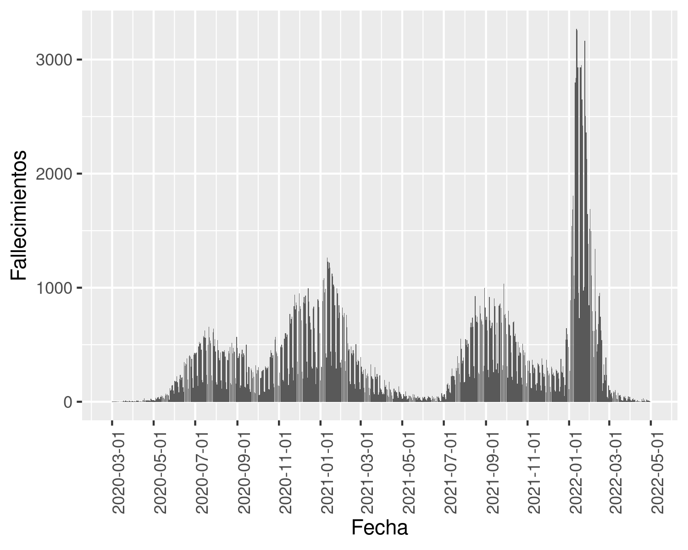\
*Fuente: Estadísticas de defunciones registradas, 2020, enero - junio 2021.*\
*Nota: Información preliminar.*

El exceso de mortalidad se explica, en primera instancia, por los fallecimientos por COVID 19, la cual es una causa no existente previamente. Se puede ver en la siguiente gráfica los fallecimientos por COVID-19 en el estado de Guanajuato por semana epidemiológica:

|**Fallecimientos diarios COVID-19**|
|:--:|
|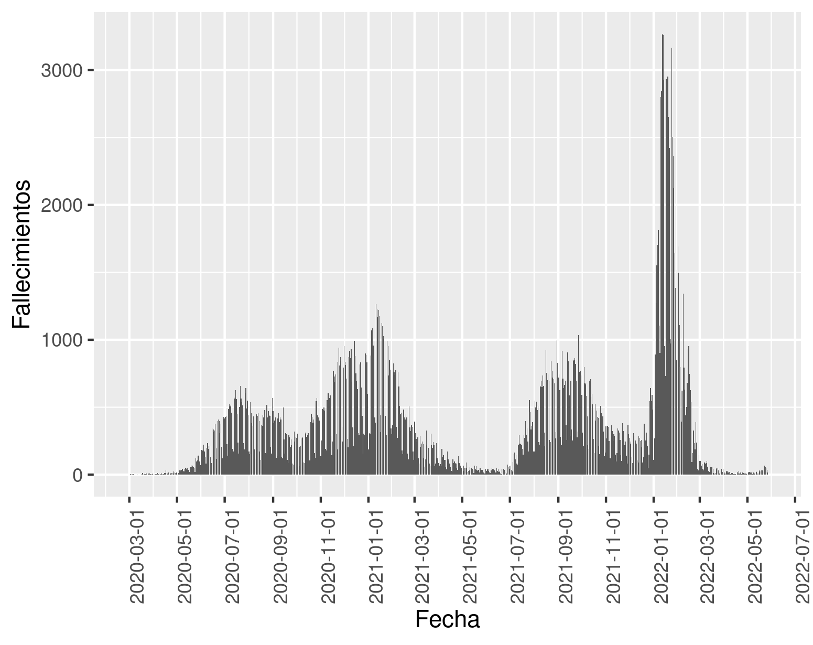|
|*Fuente: Tablero CONACYT, consultado el 22 de mayo de 2022.* 
*Nota: Información preliminar.*|

Causas de muerte
----------------

En el periodo de referencia, las tres principales causas de muerte a
nivel nacional fueron: COVID-19 (145,159; 25.0%), enfermedades del
corazón (113,899; 19.7%), y diabetes mellitus (74,418; 12.8%).

**Diez principales causas[^5] de muerte desglosadas por sexo**\
**Enero -- junio 2021**\
\
*Fuente: Estadísticas de defunciones registradas, enero-junio 2021.*\
*Nota: Información preliminar.*

Para generar la información definitiva, se realizarán como cada año,
confrontas con la Secretaría de Salud para cuatro grupos: defunciones
maternas, muertes de menores de cinco años, agresiones (presuntos
homicidios) y las provocadas por causas sujetas a vigilancia
epidemiológica, entre las que se encuentran las defunciones por la
COVID-19. La información preliminar que integra la estadística para el
periodo referido, fue suministrada por 5,086 fuentes informantes.

Las cifras definitivas que resultarán del proceso de confronta entre la
Secretaría de Salud y el INEGI serán publicadas en octubre de 2022. Esto
aplica para toda la información contenida en este comunicado y en la
nota técnica anexa.

Principales resultados preliminares de enero a junio de 2021
------------------------------------------------------------

### Total de defunciones

Durante el periodo de enero a junio de 2021 se registraron 579,596
defunciones en forma preliminar, 110,312 muertes adicionales a las
registradas durante de enero a junio de 2020.

**Defunciones registradas**\
\
*Fuente: Estadísticas de defunciones registradas, enero-junio 2012 a 2021.*\
*Nota: Información preliminar.*

Las tasas de defunción por cada 1,000 habitantes comienzan a
diferenciarse entre 2020 y 2021, a partir del grupo de edad de 45 a 54
años.

**Tasas de defunción por grupos de edad por cada 1,000 habitantes**[^6]\
**2020-2021, enero -- junio**\
\
*Fuente: Estadísticas de defunciones registradas, enero-junio 2021.*\
*Nota: Información preliminar.*

En el primer semestre de 2021, del total de las defunciones registradas
de forma preliminar, 58.1% fueron hombres, 41.8% mujeres y en 340 casos
no se especificó el sexo (0.1%).

**Defunciones registradas por sexo**\
\
*Fuente: Estadísticas de defunciones registradas, enero-junio 2021.*\
*Nota: Información preliminar.*

Enero fue el mes que presentó el mayor número de defunciones
registradas con 162,734 casos (28.1%), seguido de febrero con 115,560
(19.9%) y marzo con 93,418 (16.1%).

En las siguientes gráficas, se presenta la distribución de las
defunciones por la entidad federativa de registro y por la entidad de
residencia habitual de la persona fallecida.

**Defunciones registradas por entidad federativa de registro según sexo[^7] de la persona fallecida**\
\
*Fuente: Estadísticas de defunciones registradas, enero-junio 2021.*\
*Nota: Información preliminar.*

**Defunciones por entidad federativa de residencia habitual y sexo[^8]\ de la persona fallecida**\
\
*Fuente: Estadísticas de defunciones registradas, enero-junio 2021.*\
*Nota: Información preliminar.*

**Tasa de defunciones registradas por entidad federativa de ocurrencia por cada 10,000 habitantes**\
**Enero-junio 2021**\
\
*Fuente: Estadísticas de defunciones registradas, enero-junio 2021.*\
*Nota: Información preliminar.*

**Tasa de defunciones registradas por entidad federativa de residencia habitual del fallecido por cada 10,000 habitantes**\
**Enero-junio 2021**\
\
*Fuente: Estadísticas de defunciones registradas, enero-junio 2021.*\
*Nota: Información preliminar.*

El denominador de la tasa para el periodo 2020 corresponde a las
proyecciones de población 2016-2050 de CONAPO y a la Conciliación
Demográfica de México, 1950-2015. Para el cálculo de la tasa de 2021,
ésta se ajusta a la estimación de población elaborada por el INEGI con
base en el Marco de Muestreo de Viviendas.

Causas de la defunción
======================

Las diez principales causas de defunción se presentan a continuación,
desglosadas por sexo.

**Diez principales causas[^9]\ de muerte desglosadas por sexo Enero-junio 2021**\
\
*Fuente: Estadísticas de defunciones registradas, enero-junio 2021.*\
*Nota: Información preliminar.*

Para generar la información definitiva, se realizarán como cada año,
confrontas con la Secretaría de Salud para cuatro grupos: defunciones
maternas, muertes de menores de cinco años, agresiones (presuntos
homicidios) y las provocadas por causas sujetas a vigilancia
epidemiológica, entre las que se encuentran las defunciones por la
COVID-19.

Defunciones por la COVID-19
---------------------------

En la información preliminar del primer semestre de 2021, la COVID-19
ocupó el primer lugar dentro de las diez principales causas de muerte a
nivel general y por sexo.

**Tasas de defunciones por la COVID-19 por cada 10,000 habitantes[^10]\ por grupos de edad Enero - junio**\
\
*Fuente: Estadísticas de defunciones registradas, enero-junio 2020 y 2021*\
*Nota: Información preliminar.*

### Defunciones ocurridas por la COVID-19 por semana epidemiológica

La gráfica siguiente muestra las defunciones por la COVID-19 de enero de
2020 a junio de 2021 por semana epidemiológica, con un total de
345,415[^11] casos.

**Defunciones por la COVID-19 por semana epidemiológica (Enero 2020 - junio 2021)** [^12]\
\
*Fuente: Estadísticas de defunciones registradas, 2020, enero - junio 2021.*\
*Nota: Información preliminar.*

Asimismo, la siguiente gráfica muestra la distribución de las
frecuencias correspondientes a las defunciones por edad a causa de la
COVID-19[^13]. El valor en años para la media es de 63.5, la moda 65, la
mediana 64 y la desviación estándar de 14.3.

**Defunciones por la COVID-19 por edad**\
\
*Fuente: Estadísticas de defunciones registradas, 2020, enero - junio 2021.*\
*Nota: Información preliminar.*

Defunciones por enfermedades del corazón
----------------------------------------

Las enfermedades del corazón ocupan el segundo lugar como causa de
muerte en el total y por sexo.

**Tasas de defunciones por enfermedades del corazón por cada 10,000 habitantes**\
\
*Fuente: Estadísticas de defunciones registradas, enero-junio 2012 a 2021.*\
*Nota: Información preliminar.*

El denominador de la tasa para el periodo 2020 corresponde a las
proyecciones de población 2016-2050 de CONAPO y a la Conciliación
Demográfica de México, 1950-2015. Para el cálculo de la tasa de 2021,
ésta se ajusta a la estimación de población elaborada por el INEGI con
base en el Marco de Muestreo de Viviendas.

Defunciones por diabetes mellitus
---------------------------------

Durante el periodo de referencia, las defunciones por diabetes mellitus
ocupan el tercer lugar, tanto en el total, como entre los hombres y
mujeres.

**Tasas de defunciones por diabetes mellitus por cada 10,000 habitantes**\
\
*Fuente: Estadísticas de defunciones registradas, enero-junio 2012 a 2021.*\
*Nota: Información preliminar.*

El denominador de la tasa para el periodo 2020 corresponde a las
proyecciones de población 2016-2050 de CONAPO y a la Conciliación
Demográfica de México, 1950-2015. Para el cálculo de la tasa de 2021,
ésta se ajusta a la estimación de población elaborada por el INEGI con
base en el Marco de Muestreo de Viviendas.

Defunciones por tumores malignos
--------------------------------

La cantidad de defunciones por esta causa mantiene su tendencia
histórica, presentando una ligera disminución respecto al periodo de
referencia en el del año inmediato anterior.

**Tasas de defunciones por tumores malignos por cada 10,000 habitantes**\
\
*Fuente: Estadísticas de defunciones registradas, enero-junio 2012 a 2021.*\
*Nota: Información preliminar.*

El denominador de la tasa para el periodo 2020 corresponde a las
proyecciones de población 2016-2050 de CONAPO y a la Conciliación
Demográfica de México, 1950-2015. Para el cálculo de la tasa de 2021,
ésta se ajusta a la estimación de población elaborada por el INEGI con
base en el Marco de Muestreo de Viviendas.\

Defunciones por influenza y neumonía
------------------------------------

Del total de las muertes causadas por influenza y neumonía, que en
conjunto ascendieron a 20,956 casos, las defunciones por neumonía
representan 99.8% con 20,916 sucesos.

**Tasas de defunciones por influenza y neumonía por cada 10,000 habitantes**\
\
*Fuente: Estadísticas de defunciones registradas, enero-junio 2012 a 2021.*\
*Nota: Información preliminar.*

El denominador de la tasa para el periodo 2020 corresponde a las
proyecciones de población 2016-2050 de CONAPO y a la Conciliación
Demográfica de México, 1950-2015. Para el cálculo de la tasa de 2021,
ésta se ajusta a la estimación de población elaborada por el INEGI con
base en el Marco de Muestreo de Viviendas.

Defunciones por enfermedades del hígado
---------------------------------------

Las defunciones causadas por enfermedades del hígado presentaron una
tasa igual respecto al año anterior con un aumento de 50 casos.

**Tasas de defunciones por enfermedades del hígado por cada 10,000 habitantes**[^14]\
\
*Fuente: Estadísticas de defunciones registradas, enero-junio 2012 a 2021.*\
*Nota: Información preliminar.*

El denominador de la tasa para el periodo 2020 corresponde a las
proyecciones de población 2016-2050 de CONAPO y a la Conciliación
Demográfica de México, 1950-2015. Para el cálculo de la tasa de 2021,
ésta se ajusta a la estimación de población elaborada por el INEGI con
base en el Marco de Muestreo de Viviendas.\

Defunciones por enfermedades cerebrovasculares
----------------------------------------------

En las defunciones por esta causa no se aprecia un incremento
significativo y mantienen la tendencia que históricamente han
presentado.

**Tasas de defunciones por enfermedades cerebrovasculares por cada 10,000 habitantes**\
\
*Fuente: Estadísticas de defunciones registradas, enero-junio 2012 a 2021.*\
*Nota: Información preliminar.*

El denominador de la tasa para el periodo 2020 corresponde a las
proyecciones de población 2016-2050 de CONAPO y a la Conciliación
Demográfica de México, 1950-2015. Para el cálculo de la tasa de 2021,
ésta se ajusta a la estimación de población elaborada por el INEGI con
base en el Marco de Muestreo de Viviendas.\

Defunciones por agresiones (homicidios)
---------------------------------------

En las defunciones ocurridas en el 2021 por esta causa se aprecia un
ligero descenso respecto a 2019 y 2020.

**Tasas de defunciones por agresiones (homicidios) por cada 10,000 habitantes**\
\
*Fuente: Estadísticas de defunciones registradas, enero-junio 2012 a 2021.*\
*Nota: Información preliminar.*

El denominador de la tasa para el periodo 2020 corresponde a las
proyecciones de población 2016-2050 de CONAPO y a la Conciliación
Demográfica de México, 1950-2015. Para el cálculo de la tasa de 2021,
ésta se ajusta a la estimación de población elaborada por el INEGI con
base en el Marco de Muestreo de Viviendas.

Defunciones por accidentes
--------------------------

Respecto a 2020, los accidentes presentan un ligero repunte en el
periodo de enero a junio del 2021, acercándose a los registrados en
2019.

**Tasas de defunciones por accidentes por cada 10,000 habitantes**\
\
*Fuente: Estadísticas de defunciones registradas, enero-junio 2012 a 2021.*\
*Nota: Información preliminar.*

El denominador de la tasa para el periodo 2020 corresponde a las
proyecciones de población 2016-2050 de CONAPO y a la Conciliación
Demográfica de México, 1950-2015. Para el cálculo de la tasa de 2021,
ésta se ajusta a la estimación de población elaborada por el INEGI con
base en el Marco de Muestreo de Viviendas.

Defunciones por enfermedades pulmonares obstructivas crónicas
-------------------------------------------------------------

Para el periodo de referencia, las defunciones por esta causa
presentaron un descenso en los últimos dos años.

**Tasas de defunciones por enfermedades pulmonares obstructivas crónicas por cada 10,000 habitantes**\
**Enero-junio (2012-2021) y cierre de año (2012-2020)**\
\
*Fuente: Estadísticas de defunciones registradas, enero-junio 2012 a 2021.*\
*Nota: Información preliminar.*

El denominador de la tasa para el periodo 2020 corresponde a las
proyecciones de población 2016-2050 de CONAPO y a la Conciliación
Demográfica de México, 1950-2015. Para el cálculo de la tasa de 2021,
ésta se ajusta a la estimación de población elaborada por el INEGI con
base en el Marco de Muestreo de Viviendas.

 Estadísticas de exceso de mortalidad por las principales causas de muerte
-------------------------------------------------------------------------

La presente sección tiene como finalidad describir el exceso de
mortalidad observado en el país entre enero de 2020 y junio de 2021 como
resultado de la pandemia generada por el virus SARS-CoV-2, causante de
la COVID-19. Para ello, se consideró la metodología propuesta por la
Organización Panamericana de la Salud (OPS)[^15], utilizando como
insumo la información de las principales causas de muerte publicadas por
el INEGI ocurridas de 2015 a 2020 y la información preliminar del
periodo enero-junio de 2021. Estos datos se usan para calcular y
construir gráficas de los canales endémicos y con ello analizar la
mortalidad por semana epidemiológica[^16].

Es importante destacar que, si bien las defunciones registradas de enero
a junio de 2021 fueron 579,596, las defunciones ocurridas consideradas
en el cálculo del exceso de mortalidad en el periodo de enero de 2020 a
junio de 2021 fueron 1,649,031[^17].

Resultados
----------

A partir de la metodología referida de la OPS, los resultados a nivel
nacional por canal endémico se muestran en la gráfica siguiente. De
acuerdo con el periodo 2015-2019, se esperaban de enero de 2020 a junio
de 2021 un total de 1,116,482 defunciones y ocurrieron 1,649,031
defunciones, por lo que se tiene un exceso de mortalidad por todas las
causas de 532,549, equivalente a 47.7 por ciento.

**Exceso de mortalidad por todas las causas (semana epidemiológica 01 de 2020 a la 25 de 2021)**\
\
*Fuente: Estadísticas de defunciones registradas, 2020, enero - junio 2021.*\
*Nota: Información preliminar.*

Como parte de los presentes resultados de exceso de mortalidad y para
los mismos periodos, se realizó la estimación para cada una de las
principales afecciones, mismos que se detallan a continuación.

Exceso de mortalidad por enfermedades del corazón
-------------------------------------------------

Para el caso de las defunciones provocadas por enfermedades del corazón
se esperaban 232,658 defunciones y ocurrieron 328,970, por lo que el
exceso de mortalidad en este rubro es de 96,312 decesos que representan
41.4 por ciento.

**Exceso de mortalidad por enfermedades del corazón**\
**(semana epidemiológica 01 de 2020 a la 25 de 2021)**\
\
*Fuente: Estadísticas de defunciones registradas, 2020, enero - junio 2021*\
*Nota: Información preliminar.*

Exceso de mortalidad por diabetes mellitus
------------------------------------------

**Para las defunciones a causa de diabetes mellitus se esperaban 164,889
defunciones y ocurrieron 223,141, por lo que el exceso de mortalidad en
este apartado es de 58,252 decesos que representan 35.3 por ciento.**

**Exceso de mortalidad por diabetes mellitus**\
**(semana epidemiológica 01 de 2020 a la 25 de 2021)**\
\
*Fuente: Estadísticas de defunciones registradas, 2020, enero - junio 2021.*\
*Nota: Información preliminar.*

Exceso de mortalidad por tumores malignos
-----------------------------------------

Para el caso de las defunciones provocadas por tumores malignos se
esperaban 130,955 defunciones y ocurrieron 133,134, por lo que el exceso
de mortalidad en este rubro es de 2,179 decesos los cuales representan
1.7 por ciento.

**Exceso de mortalidad por tumores malignos**\
**(semana epidemiológica 01 de 2020 a la 25 de 2021)**\
\
*Fuente: Estadísticas de defunciones registradas, 2020, enero - junio 2021.*\
*Nota: Información preliminar.*

Exceso de mortalidad por influenza y neumonía
---------------------------------------------

Para las defunciones a causa de influenza y neumonía se esperaban
47,770 defunciones y ocurrieron 78,478, por lo que el exceso de
mortalidad en este apartado es de 30,708 decesos que representan 64.3
por ciento.

**Exceso de mortalidad por influenza y neumonía**\
**(semana epidemiológica 01 de 2020 a la 25 de 2021)**\
\
*Fuente: Estadísticas de defunciones registradas, 2020, enero - junio 2021*\
*Nota: Información preliminar.*

Exceso de mortalidad por enfermedades del hígado
------------------------------------------------

Para el caso de las defunciones por enfermedades del hígado se esperaban
60,697 defunciones y ocurrieron 61,398, por lo que el exceso de
mortalidad en este rubro es de 701 decesos que representan 1.2 por
ciento.

**Exceso de mortalidad por enfermedades del hígado**\
**(semana epidemiológica 01 de 2020 a la 25 de 2021)**\
\
*Fuente: Estadísticas de defunciones registradas, 2020, enero - junio 2021.*\
*Nota: Información preliminar.*

Exceso de mortalidad por enfermedades cerebrovasculares
-------------------------------------------------------

Para las defunciones a causa de enfermedades cerebrovasculares se
esperaban 55,234 defunciones y ocurrieron 55,101, por lo que el exceso
de mortalidad en este apartado es de 133 defunciones que representan
0.2% por debajo de lo esperado.

**Exceso de mortalidad por enfermedades cerebrovasculares**\
**(semana epidemiológica 01 de 2020 a la 25 de 2021)**\
\
*Fuente: Estadísticas de defunciones registradas, 2020, enero - junio 2021.*\
*Nota: Información preliminar.*

Exceso de mortalidad por agresiones (homicidios)
------------------------------------------------

En el caso de las defunciones provocadas por agresiones (homicidios) se
esperaban 54,097 defunciones y ocurrieron 51,931, lo que representa un
total de 2,166 decesos que equivalen a 4.0% por debajo de lo esperado.

**Exceso de mortalidad por agresiones (homicidios)**\
**(semana epidemiológica 01 de 2020 a la 25 de 2021)**\
\
*Fuente: Estadísticas de defunciones registradas, 2020, enero - junio 2021.*\
*Nota: Información preliminar.*

Exceso de mortalidad por accidentes
-----------------------------------

Para las defunciones a causa de accidentes se esperaban 56,947
defunciones y ocurrieron 48,472, lo que representa un total de 8,475
decesos que equivalen a 14.9% por debajo de lo esperado.

**Exceso de mortalidad por accidentes**\
**(semana epidemiológica 01 de 2020 a la 25 de 2021)**\
\
*Fuente: Estadísticas de defunciones registradas, 2020, enero - junio 2021.*\
*Nota: Información preliminar.*

Exceso de mortalidad por enfermedades pulmonares obstructivas crónicas
----------------------------------------------------------------------

Para el caso de las defunciones provocadas por enfermedades pulmonares
obstructivas crónicas se esperaban 38,839 defunciones y ocurrieron
30,665, lo que representa un total de 8,174 decesos que equivalen a
21.0% por debajo de lo esperado.

**Exceso de mortalidad por enfermedades pulmonares obstructivas crónicas**\
**(semana epidemiológica 01 de 2020 a la 25 de 2021)**\
\
*Fuente: Estadísticas de defunciones registradas, 2020, enero - junio 2021.*\
*Nota: Información preliminar.*

Comentarios finales
===================

Como se puede observar la aplicación de la metodología propuesta por la
OPS para identificar el exceso de mortalidad a partir de la información
preliminar de las estadísticas de defunciones registradas muestra que la
pandemia ocasionada por la COVID-19 tuvo un efecto en el incremento de
la mortalidad en general.

Es importante comentar que este informe estadístico se realizó con el
objetivo de proveer a la sociedad información oportuna en la materia;
particularmente en el contexto de la pandemia provocada por el virus
SARS-CoV-2.

La publicación definitiva de las estadísticas de defunciones registradas
del año estadístico 2021 se realizará en octubre de 2022, la cual
considerará la confronta de información que se realiza de forma anual en
conjunto con la Secretaría de Salud.

El presente documento es un primer borrador, en el cual se está
considerando concretamente, el análisis estadístico para el estado de
Guanajuato.

Bibliografía
============

Grupo Interinstitucional, (2022). Boletines Estadísticos sobre el
exceso de mortalidad por todas las causas durante la emergencia por
COVID-19. Grupo interinstitucional para la estimación del exceso de
mortalidad por todas las causas. (Serie 1 a 28). Disponible en:
<https://coronavirus.gob.mx/personal-de-salud/documentos-de-consulta/>

INEGI, (2018). Nota técnica sobre las estadísticas de defunciones
registradas 2017. Disponible en:\
<https://www.inegi.org.mx/contenidos/programas/mortalidad/doc/defunciones_registradas_2017_nota_tecnica.pdf>

INEGI, (2019). Nota técnica sobre las estadísticas de defunciones
registradas 2018. Disponible en:\
<https://www.inegi.org.mx/contenidos/programas/mortalidad/doc/defunciones_registradas_2018_nota_tecnica.pdf>

INEGI, (2020). Nota técnica sobre las estadísticas de defunciones
registradas 2019. Disponible en:\
<https://www.inegi.org.mx/contenidos/programas/mortalidad/doc/defunciones_registradas_2019_nota_tecnica.pdf>

INEGI. (2021), Defunciones registradas (mortalidad general) -
Microdatos. Disponible en:
<https://www.inegi.org.mx/programas/mortalidad/#Microdatos>

INEGI, (2021). Nota técnica sobre las estadísticas de defunciones
registradas 2020. Disponible en:\
<https://www.inegi.org.mx/contenidos/programas/mortalidad/doc/defunciones_registradas_2020_nota_tecnica.pdf>

INEGI, (2022). Mortalidad.\
https://www.inegi.org.mx/programas/mortalidad/\#Tabulados

OPS, (2020), Mejorar la vigilancia de la mortalidad por COVID-19 en
América Latina y el Caribe mediante la vigilancia de la mortalidad por
todas las causas - Documento de orientación. Mayo 2020. Disponible en:\
<https://iris.paho.org/bitstream/handle/10665.2/52309/OPSIMSPHECOVID-19200035_spa.pdf?sequence=9&isAllowed=y>

Anexos
======

**Criterios para la selección de las diez principales causas de muerte**

Las categorías de la Clasificación Estadística Internacional de
Enfermedades y Problemas Relacionados con la Salud, Décima Revisión
(CIE-10), presentan un nivel de detalle que impide tener una referencia
condensada de las defunciones registradas en el país.

Para la determinación de las principales causas de defunción se emplea
la Lista Mexicana, elaborada para esos fines por el Centro Mexicano
para la Clasificación de Enfermedades (CEMECE), la cual corresponde a
una clasificación nacional que agrupa a la CIE-10 conforme a los
siguientes criterios.

1.  Para identificar las 20 principales causas, se realizan los
    siguientes agrupamientos con base en los códigos de la Lista
    Mexicana.

| Enfermedades                          | Código |
| ------------------------------------- | -- | 
| Enfermedades infecciosas intestinales | 01 | 
| Sífilis                               |  04A-04C | 
| Hepatitis viral                       |  06J-06K | 
| COVID-19                              |  06T | 
| Tumores malignos                      |  08-15 | 
| Anemias                               |  19A-19B | 
| Enfermedades de la glándula tiroides  |  20A-20C | 
| Desnutrición y otras deficiencias nutricionales |  21 | 
| Enfermedades del corazón, excepto paro cardíaco |  26-29 | 
| Enfermedades cerebrovasculares        | 30 | 
| Infecciones respiratorias agudas      | 32A-32D, 33A, 33K | 
| Influenza y neumonía                  | 33B-33C | 
| Bronquitis crónica y la no especificada, enfisema y asma | 33D, 33E | 
| Hernia de la cavidad abdominal        | 35F-35G | 
| Enfermedades del hígado              | 35L-35M | 
| Embarazo, parto y puerperio, excepto otras causas obstétricas directas que se incluyen en las demás causas                      | 43-45 (excepto 43R) | 
| Ciertas afecciones originadas en el periodo perinatal            | 46 | 
| Malformaciones congénitas, deformidades y anomalías cromosómicas | 47 | 
| Accidentes                                         | E49-E53, E57-E58 | 

2.  Para la selección de las principales causas se excluyen las
    categorías consideradas en la CIE-10 como mal definidas, que en la
    Lista Mexicana se identifican porque terminan con la letra Z.
    También se excluyen, las causas del grupo 48 de la Lista Mexicana
    (síntomas, signos y hallazgos anormales clínicos y de laboratorio,
    no considerados en el resto de la clasificación).

Conviene mencionar que, aunque la metodología para determinar las
principales causas de defunción para México, prescinde de los eventos de
intención no determinada, por corresponder a una categoría residual
entre las defunciones accidentales y violentas, en este documento se
consideran para completar el espectro de este tipo de defunciones.

Las cifras definitivas que corresponden a la información plasmada de las
tablas 1 a la 4, que se encuentran a continuación, resultarán del
proceso de confronta entre la Secretaría de Salud y el INEGI y serán
publicadas en octubre de 2022.

**Tabla. Diez principales causas de muerte por grupos de edad.**
**Preliminar enero-junio 2021.**\
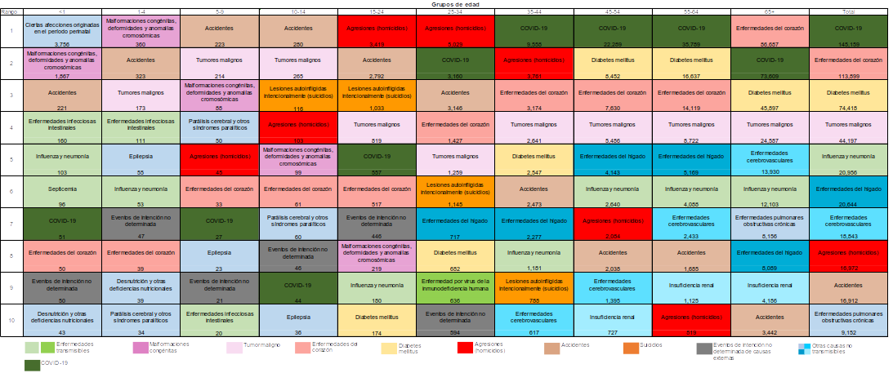\
*Fuente: Estadísticas de defunciones registradas, enero-junio 2021.*\
*Nota: Información preliminar.*

**Tabla. Diez principales causas de muerte en mujeres por grupos de edad.**\
**Preliminar enero-junio 2021.**\
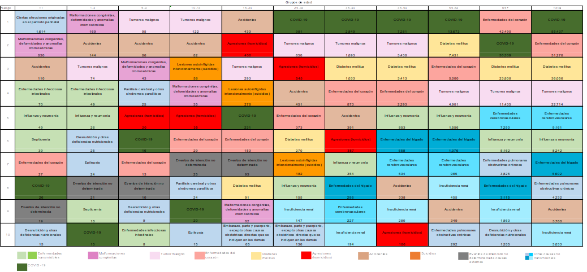\
*Fuente: Estadísticas de defunciones registradas, enero-junio 2021.*\
*Nota: Información preliminar.*

*Tabla. Diez principales causas de muerte en hombres por grupos de edad.*\
*Preliminar enero-junio 2021.*\
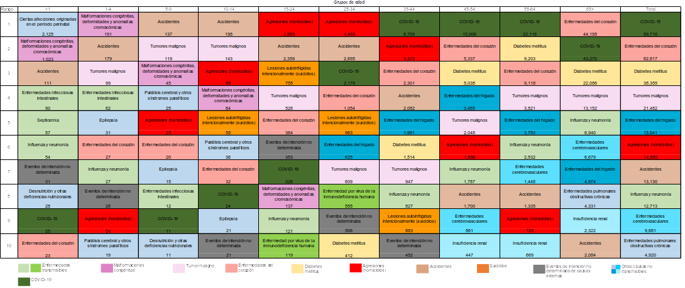\
*Fuente: Estadísticas de defunciones registradas, enero-junio 2021.*\
*Nota: Información preliminar.*

**Tabla. Cinco principales causas de muerte por entidad federativa de residencia habitual de la persona fallecida y sexo.**\
**Preliminar enero-junio 2021.**\
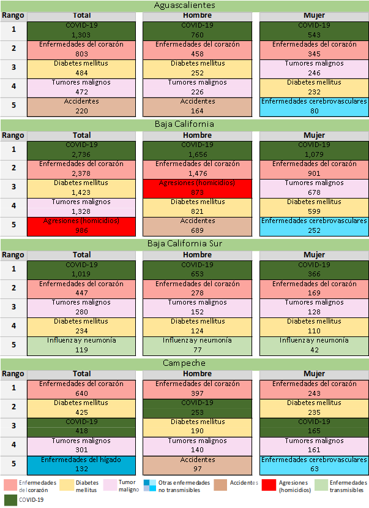\
*Fuente: Estadísticas de defunciones registradas, enero-junio 2021.*\
*Nota: Información preliminar.*

**Tabla. Cinco principales causas de muerte por entidad federativa de residencia habitual de la persona fallecida y sexo.**\
**Preliminar enero-junio2021.**\
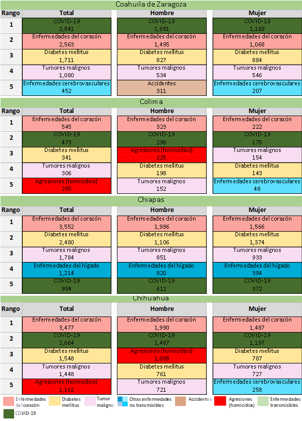\
*Fuente: Estadísticas de defunciones registradas, enero-junio 2021.*\
*Nota: Información preliminar.*

**Tabla. Cinco principales causas de muerte por entidad federativa de residencia habitual de la persona fallecida y sexo.**\
**Preliminar enero-junio 2021.**\
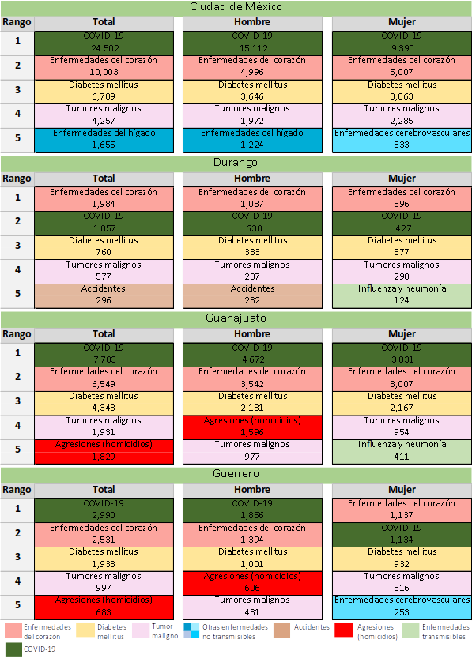\
*Fuente: Estadísticas de defunciones registradas, enero-junio 2021.*\
*Nota: Información preliminar.*

**Tabla. Cinco principales causas de muerte por entidad federativa de residencia habitual de la persona fallecida y sexo.**\
**Preliminar enero-junio 2021.**\
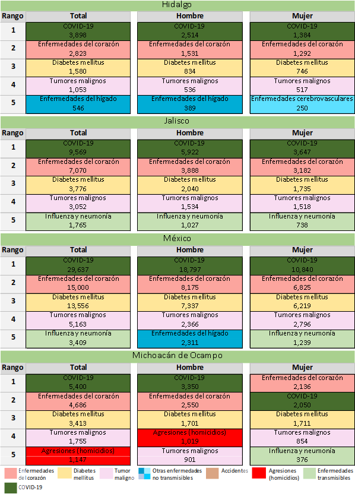\
*Fuente: Estadísticas de defunciones registradas, enero-junio 2021.*\
*Nota: Información preliminar.*

**Tabla. Cinco principales causas de muerte por entidad federativa de residencia habitual de la persona fallecida y sexo.**\
**Preliminar enero-junio 2021.**\
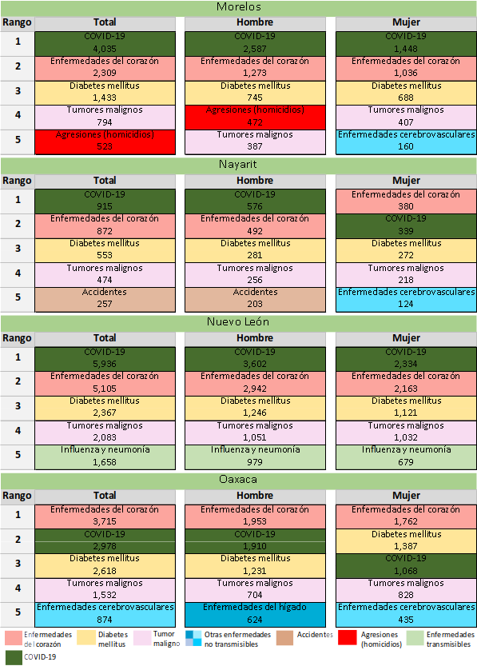\
*Fuente: Estadísticas de defunciones registradas, enero-junio 2021.*\
*Nota: Información preliminar.*

**Tabla. Cinco principales causas de muerte por entidad federativa de residencia habitual de la persona fallecida y sexo.**\
**Preliminar enero-junio 2021.**\
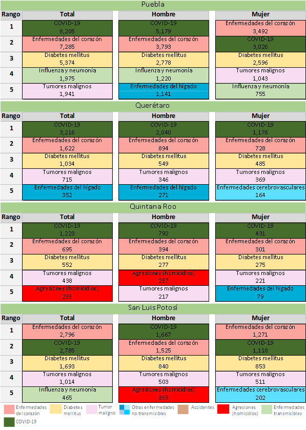\
*Fuente: Estadísticas de defunciones registradas, enero-junio 2021.*\
*Nota: Información preliminar.*

**Tabla. Cinco principales causas de muerte por entidad federativa de residencia habitual de la persona fallecida y sexo.**\
**Preliminar enero-junio 2021.**\
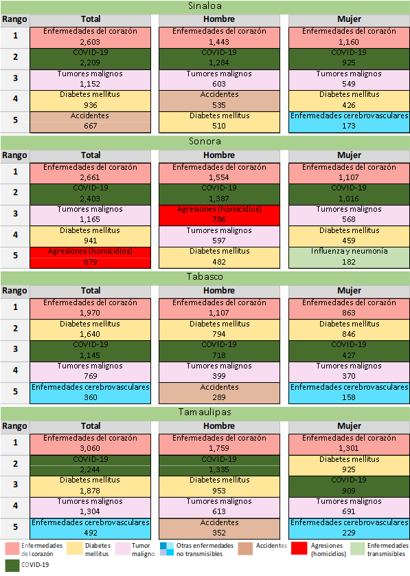\
*Fuente: Estadísticas de defunciones registradas, enero-junio 2021.*\
*Nota: Información preliminar.*

**Tabla. Cinco principales causas de muerte por entidad federativa de residencia habitual de la persona fallecida y sexo.**\
**Preliminar enero-junio 2021.**\
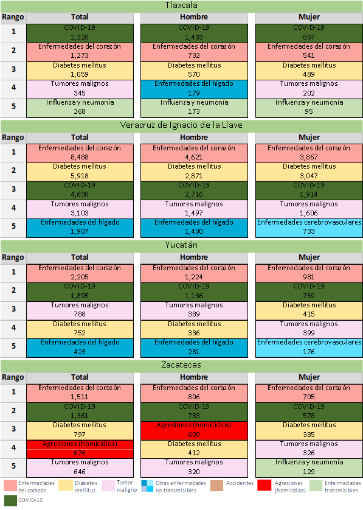\
*Fuente: Estadísticas de defunciones registradas, enero-junio 2021.*\
*Nota: Información preliminar.*

[^1]: Las defunciones causadas por la COVID-19 incluyen tanto los casos
    con referencia de virus identificado, como aquellos en los que no
    fue expresamente identificado (sospechoso). La condición preliminar
    de esta información será ratificada o modificada por la Secretaría
    de Salud y el INEGI, durante el proceso de confronta previo a
    generar las cifras definitivas en octubre de 2022.

[^2]: Defunciones con fecha de ocurrencia del 29 de diciembre de 2019 al
    26 de junio de 2021 (de la semana epidemiológica 01 de 2020 hasta la
    semana epidemiológica 25 de 2021). Las defunciones esperadas de la
    semana epidemiológica 53 fueron estimadas con base en el máximo
    valor de la semana 52 de los años 2015 a 2019, debido a que no
    existe dicha semana en el canal endémico 2015-2019. Se considera el
    exceso de mortalidad de enero 2020 a junio 2021 para apreciar el
    periodo completo de la pandemia, además de estar en concordancia con
    los boletines estadísticos sobre el exceso de mortalidad por todas
    las causas publicados por la Secretaría de Salud.

[^3]: OPS. (2020), Mejorar la vigilancia de la mortalidad por COVID-19
    en América Latina y el Caribe mediante la vigilancia de la
    mortalidad por todas las causas - Documento de orientación. Mayo
    2020. Disponible en:\
    [[https://iris.paho.org/bitstream/handle/10665.2/52309/OPSIMSPHECOVID-19200035\_spa.pdf?sequence=9&isAllowed=y]{.underline}](https://iris.paho.org/bitstream/handle/10665.2/52309/OPSIMSPHECOVID-19200035_spa.pdf?sequence=9&isAllowed=y)

[^4]: PAHO. (2016), Las semanas epidemiológicas comienzan en domingo y
    terminan en sábado; la primera semana epidemiológica del año
    termina, por definición, el primer sábado de enero, siempre que
    caiga al menos cuatro días en el mes, incluso si eso significa que
    esta primera semana comienza en diciembre. Communicable Diseases and
    Health Analysis (CHA), Health Information and Analysis (CHA/HA).
    Disponible en:\
    [[https://www.paho.org/hq/dmdocuments/2016/2016-cha-epidemiological-calendar.pdf]{.underline}](https://www.paho.org/hq/dmdocuments/2016/2016-cha-epidemiological-calendar.pdf)

[^5]: Los criterios para la selección corresponden a la Lista Mexicana,
    los cuales se encuentran en el Anexo 2 "Criterios para la selección
    de las principales causas de muerte".

[^6]: La tasa de defunciones registradas por cada 1,000 habitantes se
    presenta como referencia para facilitar la comparación entre años.
    El estudio de la mortalidad requiere la consideración de las
    defunciones ocurridas en un año determinado. El denominador de la
    tasa para el periodo 2020 corresponde a las proyecciones de
    población 2016-2050 de CONAPO y a la Conciliación Demográfica de
    México, 1950-2015. Para el cálculo de la tasa de 2021, ésta se
    ajusta a la estimación de población elaborada por el INEGI con base
    en el Marco de Muestreo de Viviendas.

[^7]: Excluye 340 casos de sexo no especificado, que se distribuyen
    entre las entidades federativas.

[^8]: Excluye 340 casos de sexo no especificado, así como 5,542 casos en
    los que la persona fallecida residía habitualmente en el extranjero
    o en los que la residencia habitual no fue especificada.

[^9]: Los criterios para la selección corresponden a la Lista Mexicana,
    los cuales se encuentran en el Anexo 2 "Criterios para la selección
    de las principales causas de muerte".

[^10]: Las cifras definitivas resultarán del proceso de confronta entre
    la Secretaría de Salud y el INEGI y serán publicadas en octubre de
    2022.\
    La tasa de defunciones registradas por cada 10,000 habitantes se
    presenta como referencia para facilitar la comparación entre años.
    El estudio de la mortalidad requiere la consideración de las
    defunciones ocurridas en un año determinado. El denominador de la
    tasa para el periodo 2012-2020 corresponde a las proyecciones de
    población 2016-2050 de CONAPO y a la Conciliación Demográfica de
    México, 1950-2015. Para el cálculo de la tasa de 2021, ésta se
    ajusta a la estimación de población elaborada por el INEGI con base
    en el Marco de Muestreo de Viviendas.

[^11]: Los 345,415 incluyen 30 casos no especificados en cuanto a fecha
    de ocurrencia de la defunción en 2020 y 19 casos en 2021 por la
    misma causa.

[^12]: Para fines ilustrativos, la gráfica de defunciones de la COVID-19
    por semana epidemiológica, se muestra hasta la número 25 de 2021
    dado que la semana epidemiológica 26 sólo incluye cuatro días del
    mes de junio de 2021.

[^13]: De los 345,415 se excluyen 111 casos por edad no especificada.

[^14]: Las cifras definitivas resultarán del proceso de confronta entre
    la Secretaría de Salud y el INEGI y serán publicadas en octubre de
    2022.\
    La tasa de defunciones registradas por cada 10,000 habitantes se
    presenta como referencia para facilitar la comparación entre años.
    El estudio de la mortalidad requiere la consideración de las
    defunciones ocurridas en un año determinado. El denominador de la
    tasa para el periodo 2012-2020 corresponde a las proyecciones de
    población 2016-2050 de CONAPO y a la Conciliación Demográfica de
    México, 1950-2015. Para el cálculo de la tasa de 2021, ésta se
    ajusta a la estimación de población elaborada por el INEGI con
    base en el Marco de Muestreo de Viviendas.

[^15]: *Mejorar la vigilancia de la mortalidad por COVID-19 en América
    Latina y el Caribe mediante la vigilancia de la mortalidad por todas
    las causas.*
    [**[https://iris.paho.org/bitstream/handle/10665.2/52309/OPSIMSPHECOVID-19200035\_spa.pdf?sequence=9&isAllowed=y]{.underline}**](https://iris.paho.org/bitstream/handle/10665.2/52309/OPSIMSPHECOVID-19200035_spa.pdf?sequence=9&isAllowed=y)

[^16]: Las semanas epidemiológicas inician los domingos y terminan los
    sábados.

[^17]: Defunciones con fecha de ocurrencia del 29 de diciembre de 2019
    al 26 de junio de 2021 (de la semana epidemiológica 01 de 2020 hasta
    la semana epidemiológica 25 de 2021). Las defunciones esperadas de
    la semana epidemiológica 53 de 2020 fueron estimadas con base en el
    máximo valor de la semana 52 de los años 2015 a 2019, debido a que
    no existe dicha semana en el canal endémico 2015-2019.
